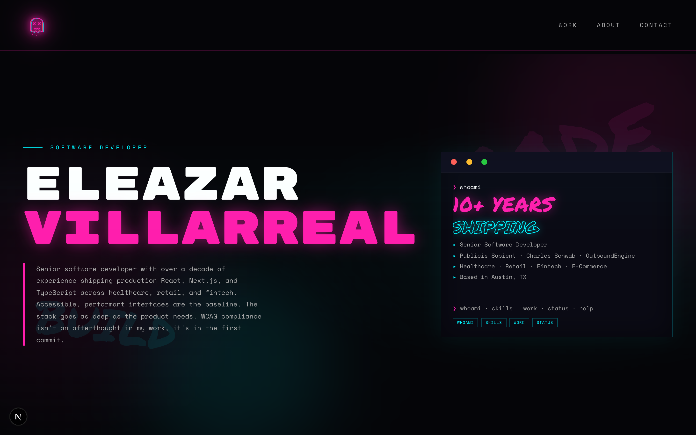
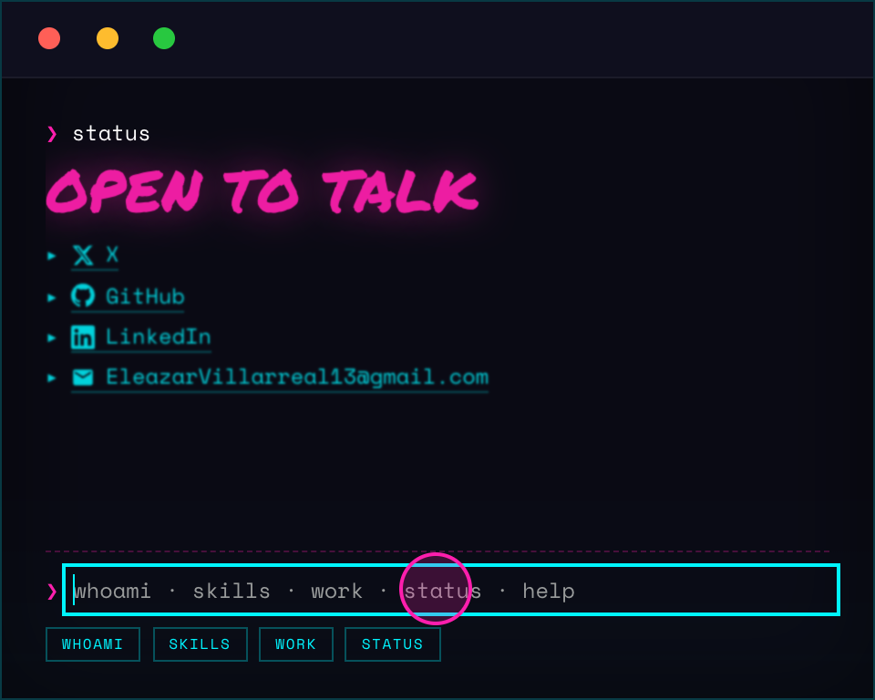
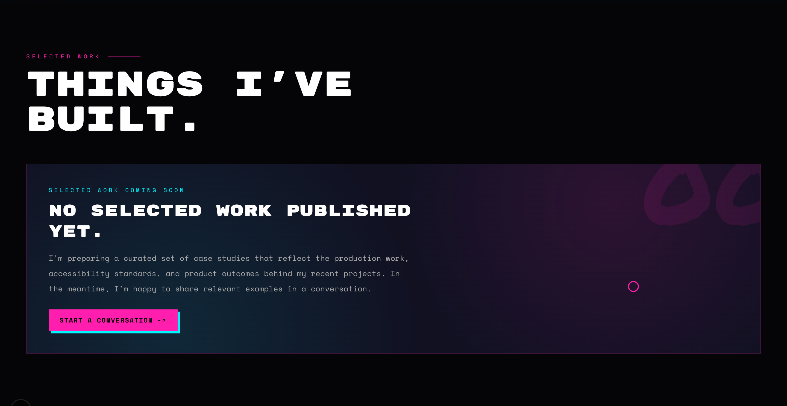
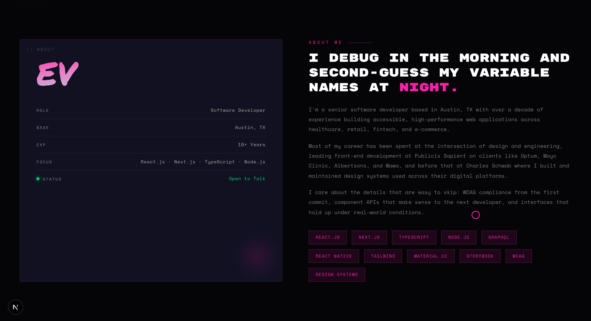

# Eleazar Villarreal — Portfolio

A personal portfolio site with a neon, graffiti-inspired aesthetic and an interactive
terminal at its center. Built with the Next.js App Router, React 19, and Tailwind CSS v4,
with accessibility treated as a baseline rather than an afterthought.



---

## Highlights

- **Interactive hero terminal** — type `whoami`, `skills`, `work`, `status`, or `help`
  (or click the command chips). Output is keyboard-accessible and announced to screen
  readers via an `aria-live` log region.
- **Accessibility first** — skip link, semantic landmarks, focus management with `inert`,
  visible focus rings, WCAG-AA contrast, and full `prefers-reduced-motion` support.
- **Zero UI dependencies** — every component, animation, and icon is hand-built.
- A few surprises are tucked away for the curious. 👀

| The interactive terminal | Selected work |
|---|---|
|  |  |



---

## Tech stack

| Area | Choice |
|---|---|
| Framework | [Next.js 16](https://nextjs.org) (App Router, React Server Components) |
| UI library | [React 19](https://react.dev) + [React Compiler](https://react.dev/learn/react-compiler) |
| Language | [TypeScript](https://www.typescriptlang.org) (strict mode) |
| Styling | [Tailwind CSS v4](https://tailwindcss.com) with CSS custom-property design tokens |
| Fonts | `next/font` — Space Mono, Rubik Mono One, Permanent Marker |
| Tooling | ESLint (`eslint-config-next`) |

No external state, UI, or animation libraries — all interactivity is local React state
and all motion is hand-authored CSS keyframes.

---

## Getting started

```bash
pnpm install
pnpm dev
```

Open [http://localhost:3000](http://localhost:3000).

### Scripts

| Command | Description |
|---|---|
| `pnpm dev` | Start the dev server |
| `pnpm build` | Production build |
| `pnpm start` | Serve the production build |
| `pnpm lint` | Run ESLint |

---

## Project structure

The codebase favors small, single-responsibility modules. Content lives in a dedicated
data layer, logic lives in hooks, and each feature folder exposes a barrel (`index.ts`)
so consumers import from the folder rather than reaching into individual files.

```
src/
├── app/                  # App Router entry: layout, page, global styles
│   ├── layout.tsx        # Root layout, fonts, skip link, nav, footer
│   ├── page.tsx          # Composes the page sections
│   └── globals.css       # Design tokens + keyframe animations
├── components/
│   ├── terminal/         # The interactive terminal (shell + sub-components)
│   ├── icons/            # Hand-built SVG icon components
│   ├── hero-section.tsx
│   ├── about-section.tsx
│   ├── work-section.tsx
│   ├── contact-section.tsx
│   ├── nav-bar.tsx
│   ├── footer.tsx
│   ├── empty-work-state.tsx
│   ├── custom-cursor.tsx
│   └── logo.tsx
├── hooks/                # Terminal state & behavior hooks
├── constants/            # Animation timing
├── data/                 # Content: profile, skills, nav, social, terminal output
└── lib/                  # Pure logic (terminal command building)
```

### Architecture notes

- **Data layer (`src/data`)** — page content (profile details, skills, nav items, social
  links, terminal command output) is authored as typed data, separate from presentation.
  Adding a new terminal command or social link means editing data, not JSX.
- **Hooks (`src/hooks`)** — `useTerminal` owns terminal state and command dispatch;
  companion hooks encapsulate the terminal's richer interactive sequences.
- **Design tokens** — colors live as CSS custom properties in `globals.css` and are
  surfaced to Tailwind via `@theme`, so there are no hardcoded hex values in components.
- **Server vs. client** — only genuinely interactive components opt into `'use client'`;
  the rest render on the server.

---

## Accessibility

Accessibility is a first-class concern, not a pass at the end:

- Skip-to-content link and semantic landmarks (`header`, `nav`, `main`, `footer`).
- Modal dialogs trap focus and restore it to the trigger on close; background content is
  disabled with `inert`.
- The terminal output is an `aria-live` log; decorative graffiti, icons, and effects are
  `aria-hidden`.
- WCAG-AA color contrast for text, and visible focus rings on every interactive element.
- Every animation — glitch text, scanlines, and the terminal reveal — is disabled or made
  instant under `prefers-reduced-motion`.

---

## Contact

- **Email** — [EleazarVillarreal13@gmail.com](mailto:EleazarVillarreal13@gmail.com)
- **GitHub** — [@EleazarVillarreal](https://github.com/EleazarVillarreal)
- **LinkedIn** — [eleazar-villarreal](https://www.linkedin.com/in/eleazar-villarreal/)
